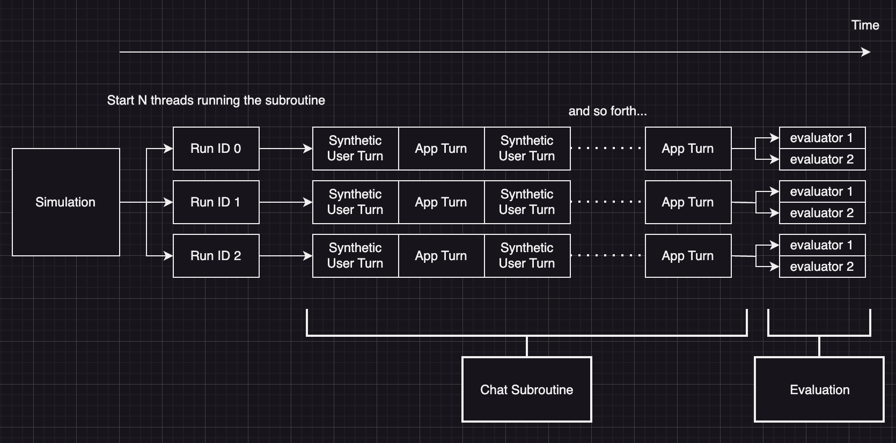

# AI Testing and Simulation Framework

Realign is a testing and simulation framework for AI applications. It simulates user interactions, evaluates AI performance, and generates adverserial test cases to red-team AI applications.

## Installation & Setup

To install the package, run

`pip install realign`

Set your API keys as environment variables:

```sh
export OPENAI_API_KEY="your_openai_key"
```

or put them in a `.env` file:

```sh
OPENAI_API_KEY="your_openai_key"
```

## Why We Built Realign

Testing multi-turn AI applications is hard. Here's why:

1. **Context Dependence**: In a multi-turn interaction, each response depends on the conversation history. Static test cases cannot capture this complexity.
2. **Diverse Scenarios**: Real users behave unpredictably. It's impossible to manually write test cases for every scenario.
3. **Evolving Conversations**: As conversations progress, they can drift from their original topic or intent. Detecting and evaluating these shifts pre-production is crucial.
4. **Compounding Errors**: Small mistakes in early turns can lead to larger issues later. Identifying these patterns requires analyzing full conversation trajectories.

Realign addresses these challenges by:

- Simulating dynamic user behavior in real-time using LLMs
- Automatically generating adverserial test cases, user personas, and scenarios using LLMs
- Evaluating entire conversation flows, not just individual responses, using LLMs, binary classifiers, and more
- Allowing custom evaluation criteria for domain-specific use cases

## Key Features

1. Simulate user interactions over multiple turns
2. Run component-level evaluations on specific steps, turns, and entire conversation trajectories
3. Synthetically generate test cases and simulation scenarios
4. Run tests and simulations locally or in CI/CD pipelines
5. Define custom evaluators aligned with your domain and use-case

## Quickstart
 
 We'll be walking through an example. To skip the tutorial and run the file, `pip install realign`, paste [this file](https://github.com/honeyhiveai/realign/blob/main/examples/example_chat_simulation.py) into your editor, and run.

Let’s say you want to build a AI tutoring assistant that helps a student learn a new concept. At first, it might be difficult to tune the prompt and evaluate results. Simulation can be a powerful tool to help you develop and improve your application quickly.

A simulation has 3 main steps:

1. Initialize the Simulation
2. Run the Simulation
3. Save run & eval results to a dataset



We first initialize the `ChatSimulation` so and ask it to run 3 conversations of 10 messages each. 

```python
from realign.agents import ChatAgent, SyntheticUserBuilder
from realign.simulation import ChatSimulation
from realign.evaluators.llm_evaluators import allm_toxicity_rating, allm_user_engagement

# initialize simulation
simulation = ChatSimulation(runs=10, max_messages=20)
```

Next, we set the `simulation.app` param. This is your main `ChatAgent` that you want to test. 

```python
# initialize your app agent
simulation.app = ChatAgent(system_prompt='''
    As an AI tutor, your role is to guide student learning across various subjects through explanations and questions. \
    Assess student knowledge and adapt your approach accordingly, providing clear explanations with simple terms and examples.
''')
```

We then set the simulator which will run your app. In the ChatSimulation case, the simulator is a synthetic user generator. We use the `SyntheticUserBuilder` utility to specify a persona and scenario. Realign leverages 1000 diverse personas to seed each simulated conversation and create diverse scenarios.

```python
# initialize your synthetic user agent builder
simulation.simulator = SyntheticUserBuilder().as_a('student').they_want_to('learn something new')
														
# Generates personas whose first chat message is as follows:
# Hi, I'm Saman, a graduate student at Duke Kunshan University, and I'd love to dive into the world of quantum mechanics starting with an overview of the field.
# Hi, I'm Addy, a graduate student studying international relations, and I'm eager to explore the phenomenon of emerging powers; could you provide a brief overview of what emerging powers are in the context of international relations?
# Hi, I'm AJ, a university psychology student, and I'd love to explore the relationship between creativity and personality traits - could you break it down for me?

# to use a different model for the synthetic user agent
# simulation.simulator.with_synth_user_model('openai/gpt-4o-mini')
```

We want the simulation be fast, and so the default synthetic user uses `openai/gpt-4o-mini`.

Finally, we specify a list of evaluators which will be run after each simulation run is complete. To create your own custom evaluators, refer to the docs below.

```python
# add evaluators
simulation.evaluators = [allm_toxicity_rating, allm_user_engagement]
```

To actually run the simulation, simply call `simulation.run()`. Push the run data and evaluation data to json files using the following functions:

```python
# run simulation
simulation.run()

# publish simulation run and eval results
simulation.push_runs_to_dataset('src/realign/data/run_data.json')
simulation.push_evals_dataset('src/realign/data/eval_data.json')
```

Here’s the plug-and-play file:

```python
from realign.agents import ChatAgent, SyntheticUserBuilder
from realign.simulation import ChatSimulation
from realign.evaluators.llm_evaluators import allm_toxicity_rating, allm_user_engagement

# initialize simulation
simulation = ChatSimulation(runs=10, max_messages=20)

# initialize your app agent
simulation.app = ChatAgent(system_prompt='''
    As an AI tutor, your role is to guide student learning across various subjects through explanations and questions. \
    Assess student knowledge and adapt your approach accordingly, providing clear explanations with simple terms and examples.
''', model='openai/gpt-4o-mini')

# initialize your synthetic user agent builder
simulation.simulator = SyntheticUserBuilder().as_a('student').they_want_to('learn something new')

# to use a different model for the synthetic user agent
# simulation.simulator.with_synth_user_model('openai/gpt-4o-mini')

# add evaluators
simulation.evaluators = [allm_toxicity_rating, allm_user_engagement]

# run simulation
simulation.run()

# publish simulation run and eval results
simulation.push_runs_to_dataset('src/realign/data/run_data.json')
simulation.push_evals_dataset('src/realign/data/eval_data.json')
```

# Core Concepts

## Evaluators

### **What is an `evaluator`?**

An evaluator is a function which measures the quality of an LLM application output by giving it a `score` and evaluating a bool `result` which indicates whether if the score is in the target range.

It follows the signature:

```python
from realign.evaluation import evaluator

@evaluator
def evaluator(output):
	
	# calculate score of the output
	score = ...
	
	# evaluate whether the score is in the target range
	result = score > target
	
	return score, result
```

The `output` is a key-value pair of various output params. For example, a multi step application could have the output:

```python
output = {
  'messages': [ 
    {'role': 'user', 'content': 'What is the capital of France?'}, 
    {'role': 'assistant', 'content': 'The capital of France is Paris'}
  ]
}
```

### What is the @evaluator decorator?

The `@evaluator` decorator simply helps you wrap your evaluator output as an object which has some in built helpers. Importantly, it allows you do use your evaluation as a guardrail in your code as follows:

```python
from realign.evaluators.llm_evaluators import allm_toxicity_rating, allm_topic_classification

import asyncio

async def main():
    messages = []

    # ... run your application

    evaluation = await allm_toxicity_rating(messages)

    if evaluation.result == False:
        raise Exception('Output failed quality guardrail.')

    print('Score:', evaluation.score)

    classes = ['solve a problem', 'explain a concept']

    # the unpack() function will return the score and result
    score, result = await allm_topic_classification(messages, categories).unpack()

    assert result
    print('Class:', score) # will print the category
    
if __name__ == "__main__":
    asyncio.run(main())
```

### Which evaluators should I use?

Realign offers a library of well-tuned evaluators which you can directly import into your application or test suite. You can also create a custom evaluator by implementing a function with the same format. Evaluators generally come in 3 different flavors:

- Python evaluators (code, API calls, 3rd party libraries, etc)
- LLM as a judge evaluators (using an intelligent model to evaluate)
- NLP evaluators (such as BERT-based evaluators)

## ModelSettings

ModelSettings are used to specify all the ***stateless*** settings of an LLM calls. By stateless, we mean all the settings which don’t depend on the application / agent state. For example, ModelSettings does not include `messages` since it is *stateful.*

ModelSettings applies to *all* LLM calls in Realign, including app agent LLM calls, synthetic user LLM calls, and evaluator LLM calls. 

Here’s the spec for ModelSettings:

```python
@dataclass
class ModelSettings:
		# litellm model name. Refer to https://docs.litellm.ai/docs/providers.
    model: str 
    
    # API key env variable name. 
    # If not provided, defaults to <MODEL_PROVIDER>_API_KEY format
    api_key: Optional[str] = None
    
    # hyperparam dictionary in OpenAI format, eg. { 'temperature': 0.8 }
    hyperparams: Optional[dict[str, Any]] = None
		
		# literal system prompt
		# if provided, template/prompt_params will be ignored
    system_prompt: Optional[str] = None

		# Jinja template and prompt_param dictionary to render it
	  # string key for the template. Actual templates defined in realign.prompts
    prompt_params: Optional[dict[str, str]] = None
    template: Optional[str] = None

		# json_mode for the response format
    json_mode: Optional[bool] = False
    
    # user or assistant
    role: str = 'assistant'
```

## Datasets

In Realign, there are 2 types of datasets:

- The Run Dataset stores the final state of your simulation run (messages for chat simulations)
- The Eval Dataset stores the evaluation results and scores of your simulation runs

The `simulation.push_runs_to_dataset()` and `simulation.push_evals_dataset()` functions are used to save the run and eval data to a json file respectively.

Dataset tooling is coming soon!

## Simulation

### What is a Simulation?

- A simulation is a subroutine that runs N times.
- Within the subroutine, your App agent will interact with the Simulator environment for several turns.
- After the last turn, the Evaluator functions will be run on the final state of the simulation to compute various metrics.

### Why should I simulate?

- For multi-turn applications, traditional playgrounds don’t scale well since it becomes harder to mock user turns.
- Since the LLM behavior is stochastic, it becomes difficult to reach and evaluate the wide variety of possible states of your application. For example, you want to know the average topic of conversation between turns 10-15 of your chatbot’s conversation.
- Simulations in Realign run on multiple threads simultaneously, saving you time and energy.

### How do Simulations work?

Each simulation manages, transforms, and evaluates the state of your application. For example, in the ChatSimulation case, the state is a list of openai messages: `messages = [OpenAIMessage(...role, ...content), ...]`

- The App and SyntheticUser update the state each turn by adding a new message given previous messages
- The chat Evaluator functions take `messages` as their input parameter and return the score and result for that state.

The `state` is an abstract concept that ties together your application, the simulator, and the evaluators. It is not typed in the Realign SDK and left open ended for ease of development. However, designing around the shape of your agent `state` can help you create systematic simulation and evaluation flows.


### What is the Simulator?

Your agent likely has external dependencies, such as a human user or a third party API call. All such dependencies must be simulated for your agent to function. The `simulation.simulator` param specifies this simulator.

You might wonder why we pass in a SyntheticUserBuilder instead of a SyntheticUser. This is because the simulator will `yield` a new SyntheticUser each time a subroutine is spawned, and so what we need to pass in is the *synthetic user generator* rather than the actual synthetic user. Here’s how it works:

- Synthetic user builder yields a new persona for every simulation run
- The SyntheticUserBuilder is initialized using persona and scenario. Each run will have variants of different personas based on what you specify.
- Realign’s SyntheticUserBuilder leverages 1000 personas specified in the `persona-hub/personas.jsonl` file. For more information, please refer to the [Persona Hub paper.](https://arxiv.org/pdf/2406.20094)


# Contributing

We welcome contributions from the community to help make Realign better. This guide will help you get started. If you have any questions, please reach out to us on [Discord](https://discord.gg/vqctGpqA97) or through a [GitHub issue](https://github.com/honeyhiveai/realign/issues/new).

## Project Overview

Realign is an MIT licensed testing framework for multi-turn AI applications. It simulates user interactions, evaluates AI performance, and generates adverserial test cases.

We particularly welcome contributions in the following areas:

- Bug fixes
- Documentation updates, including examples and guides

## Getting Started

1. Fork the repository on GitHub.
2. Clone your fork locally:

   ```sh
   git clone https://github.com/[your-username]/realign.git
   cd realign
   ```

3. Set up your development environment:

   ```sh
   pip install -r requirements.txt
   ```


## Development Workflow

1. Create a new branch for your feature or bug fix:

   ```sh
   git checkout -b feature/your-feature-name
   ```

2. We try to follow the [Conventional Commits](https://www.conventionalcommits.org/) specification. This is not required for feature branches. We merge all PRs into `main` with a squash merge and a conventional commit message.

3. Push your branch to your fork:

   ```sh
   git push origin your-branch-name
   ```

4. Open a pull request against the `main` branch of the promptfoo repository.

When opening a pull request:

- Keep changes small and focused. Avoid mixing refactors with new features.
- Ensure test coverage for new code or bug fixes.
- Provide clear instructions on how to reproduce the problem or test the new feature.
- Be responsive to feedback and be prepared to make changes if requested.
- Ensure your tests are passing and your code is properly linted.

Don't hesitate to ask for help. We're here to support you. If you're worried about whether your PR will be accepted, please talk to us first (see [Getting Help](#getting-help)).


## Getting Help

If you need help or have questions, you can:

- Open an issue on GitHub.
- Join our [Discord community](https://discord.gg/vqctGpqA97).

## Code of Conduct

We follow the [Contributor Covenant Code of Conduct](https://www.contributor-covenant.org/). Please read and adhere to it in all interactions within our community.