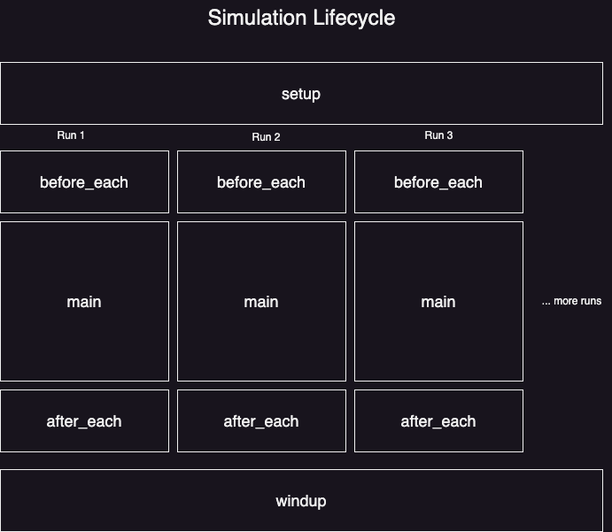

# Realign: Evaluation & Experimentation Framework for AI Applications


`realign` is an evaluation and experimentation framework for building reliable AI applications through test-driven development. Test and evaluate agent architectures, RAG systems, prompts, and models across hundreds of scenarios specific to your use-case.

### 🎯 With Realign, you can:

- **Build reliable AI agents** and RAG systems with test suites tailored to your use-case
- **Evaluate quality** by simulating your agents over hundreds of scenarios in parallel
- **Experiment with 100+ models,** prompts, and other parameters to find optimal configurations
- **Detect regressions** by integrating test suites with your CI/CD pipeline
- **Track experiments** with HoneyHive for cloud-scale analytics, visualization, and reproducibility

### 💡 What’s unique about Realign

- **YAML-Driven DX:** Cleanly manage your agents, evaluator prompts, datasets, and other parameters using easy-to-read YAML config files
- **Composable Evaluators:** Automatically evaluate quality using our library of 25+ pre-built evaluators, or create your own using composable building blocks
- **Blazing Fast Execution:** Speed up your evaluations with parallel processing and async capabilities, with built-in modules for smart rate limiting
- **Statistical Rigor:** Use statistics to test hypotheses and sweep hyperparameters to optimize performance

# Quickstart

## Installation & Setup

To install the package, run

```bash
pip install realign
```

Set your API keys as environment variables:

```bash
export OPENAI_API_KEY="your_openai_key"
```

or put them in a `.env` file:

```bash
OPENAI_API_KEY="your_openai_key"
```

## Tweet Generator

Let's build an agent that produces content for your brand.

> **Tweetbot**: generates N high quality tweets concurrently, evaluates them using Python code, HuggingFace classifiers, and LLM Judge (multiple runs, aggregated scores). 

Please download and run this code!

### Code: [tweetbot.py](https://github.com/honeyhiveai/realign/blob/main/examples/tweetbot/tweetbot.py)

### Config: [config.yaml](https://github.com/honeyhiveai/realign/blob/main/examples/tweetbot/config.yaml)

# [Tutorials](docs/TUTORIALS.md)

1. [Simple Tweet Bot](docs/TUTORIALS.md#simple-tweet-bot): Generate tweets with any model using a prompt and template
2. [Generate 10 Tweets in Parallel (Async)](docs/TUTORIALS.md#generate-10-tweets-in-parallel-async): Generate tweets concurrently using async
3. [Using Config Files](docs/TUTORIALS.md#using-config-files): Setup config files to separate code and config
4. [Set up Evaluators](docs/TUTORIALS.md#set-up-evaluators): Set up evaluator functions, new and built-in
5. [Using Realign Evaluators](docs/TUTORIALS.md#using-realign-evaluators): Use evaluators with configs

# [Concepts](docs/CONCEPTS.md)

### 1. [@evaluator decorator](docs/CONCEPTS.md#evaluator-and-aevaluator)

Learn how you can set up evaluators, and configure them with
- wrapping
- transforming
- aggregating
- checking
- other settings and kwargs

> An **Evaluator** is a function which *scores* your app's output and *checks* if the score is within a *target* range.

### 2. [Simulation](docs/CONCEPTS.md#simulation)

> A **Simulation** is a stochastic process that runs N times. It has statistical properties.

 

### 3. [Agents](docs/CONCEPTS.md#agents)

> An LLM agent comprises the settings, instructions, and context given to an LLM to autonomously complete a certain task.

Set them up with
- `agent_name`

- the model settings
  
  - `model`: >100 providers/models
  
  - `hyperparams`: dictionary of OpenAI-type hyperparams

- the prompt
  
  - `system_prompt`: a space for your agent's instructions
  
  - `template`: a template with variables marked with double curlies {{var}}
  
  - `template_params`: a dictionary mapping the variable names to their actual values
  
  - `json_mode`: a boolean flag which will deserialize the JSON response into a Python dict

# Guides

- [TODO] how do I evaluate my agent?

- [TODO] how to I customize my evaluator?

- [TODO] how do I improve my agent?

- [TODO] how do I improve my RAG pipeline?

# API Reference

coming soon!

# Contributing

We welcome contributions from the community to help make Realign better. This guide will help you get started. If you have any questions, please reach out to us on [Discord](https://discord.gg/vqctGpqA97) or through a [GitHub issue](https://github.com/honeyhiveai/realign/issues/new).

### Project Overview

Realign is an MIT licensed testing framework for multi-turn AI applications. It simulates user interactions, evaluates AI performance, and generates adversarial test cases.

We particularly welcome contributions in the following areas:

- Bug fixes

- Documentation updates, including examples and guides

### Getting Started

1. Fork the repository on GitHub.

2. Clone your fork locally:

```sh
git clone https://github.com/[your-username]/realign.git

cd realign
```

3. Set up your development environment:

```sh
pip install -r requirements.txt
```

### Development Workflow

1. Create a new branch for your feature or bug fix:

```sh
git checkout -b feature/your-feature-name
```

2. We try to follow the [Conventional Commits](https://www.conventionalcommits.org/) specification. This is not required for feature branches. We merge all PRs into `main` with a squash merge and a conventional commit message.

3. Push your branch to your fork:

```sh
git push origin your-branch-name
```

4. Open a pull request against the `main` branch of the promptfoo repository.

When opening a pull request:

- Keep changes small and focused. Avoid mixing refactors with new features.

- Ensure test coverage for new code or bug fixes.

- Provide clear instructions on how to reproduce the problem or test the new feature.

- Be responsive to feedback and be prepared to make changes if requested.

- Ensure your tests are passing and your code is properly linted.

Don't hesitate to ask for help. We're here to support you. If you're worried about whether your PR will be accepted, please talk to us first (see [Getting Help](#getting-help)).

### Getting Help

If you need help or have questions, you can:

- Open an issue on GitHub.

- Join our [Discord community](https://discord.gg/vqctGpqA97).

### Code of Conduct

We follow the [Contributor Covenant Code of Conduct](https://www.contributor-covenant.org/). Please read and adhere to it in all interactions within our community.
