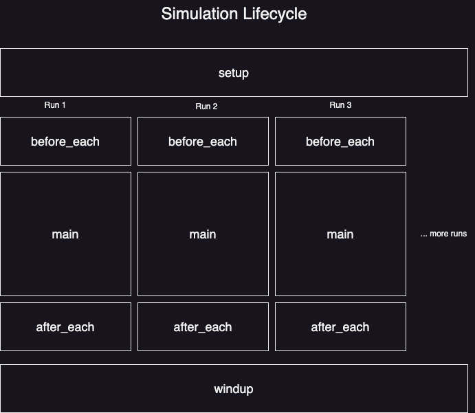

# Concepts

## @evaluator and @aevaluator

What is an evaluator?

> An **Evaluator** is a function which *scores* your app's output and *checks* if the score is within a *target* range.

Any function decorated with @evaluator will fetch the configs for running that evaluator:

- `wraps`: wrap a base evaluator with keyword arguments specified in this config to create a new evaluator.

- `transform`: apply a Python code transformation after your evaluator is executed. Useful for mapping / filtering your output. You can reference other evaluators here too.

- `repeat`: number of times to repeat the evaluator (useful for stochastic evaluators such as LLM judges)

- `aggregate`: apply a Python co

- `checker`: apply a Python code check whether the output is in the target range

- `asserts`: apply the Python `assert` keyword to final output

- `**kwargs`: any additional key-value pairs are passed in as keyword arguments to the evaluator func

The order of operations is as follows:

1. If `repeat` is provided, repeat the following steps the given number of times and output a list of `values`. If not, the output from the evaluator implementation (with `wraps` or `transform` if provided) will be stored in `results` and `values`.
   
   1. If `wraps` is provided, run the wrapped evaluator with any keyword arguments
   
   2. If `transform` is provided, apply the transformation. You can use the `result` and `value` variable
   
   3. If neither `wraps` or `transform` provided, run the pure evaluator implementation.
   
   4. The value (or 

2. If `aggregate` is provided, apply the aggregation. You can use the `results` and `values` variables in the string, as well as any evaluators you've defined or ones from the library. If there is no `repeat` provided, the aggregation will be performed on the output of the previous block.

3. If `checker` is provided, apply the checker. You can use the `value`, `results`, and `target` variables in the string, as well as any evaluators you've defined or ones from the library. `target` is si

4. If `asserts` is provided the output of the pipeline is asserted, which means it will raise an exception if the previous value is falsy. 

## Simulation

Given the stochastic nature of your LLM agents, it is advisable to run your agent multiple times for every change to the config.

In Realign, you can run your application quickly and concurrently using Simulation. 

What is a simulation?

> A **Simulation** is a stochastic process that runs N times. It has statistical properties.

In Realign, a simulation lifecycle has 5 steps, shaped like a hamburger around your main application:

1. `setup`: runs once before the N concurrent runs begin.
   
   - setup can be used for initializing your application and creating the seed.
   
   - you can set arbitrary variables to the simulation state using `self.key = object` (Python instance variables)
   
   - NOTE: ensure that the values you set are thread safe since these will be accessed by multiple threads.

2. `before_each`: runs once before each of the N concurrent runs begin.
   
   - before_each can be used to generate the initial conditions for the run
   
   - you can set up any synthetic users or specific test cases here

3. `main`: the main process of your agentic application, repeated N times.
   
   - the main process of your application runs here

4. `after_each`: runs once after each of the N concurrent runs end.
   
   - after_each can be used for running evaluations for the run and collecting any telemetry

5. `windup`: runs once after the N concurrent runs end.
   
   - windup is used to store the final states and calculate any statistics based on the overall simulation

 

## Agents

An LLM agent is defined by its various settings. In Realign, you can configure your agents using the `llm_agents` key in your config file.

- `agent_name`: reference to the agent's defining settings

- the model settings
  
  - `model`: provider/model
  
  - `hyperparams`: dictionary of OpenAI-type hyperparams

- the prompt
  
  - `system_prompt`: a space for your agent's instructions
  
  - `template`: a template with variables marked with double curlies {{var}}
  
  - `template_params`: a dictionary mapping the variable names to their actual values
  
  - `json_mode`: a boolean flag which will deserialize the JSON response into a Python dict

In Realign you have access to a utility called `llm_messages_call` and `allm_messages_call` which allow you to make a call to over 100 models in similar format to OpenAI (please include the keys of whichever providers you'd like to use).

Say goodbye to installing and importing various clients and managing their schemas. Thanks to our thread-safe, rate-limit aware LiteLLM proxy, you can focus on using the LLM models, not integrating them.

